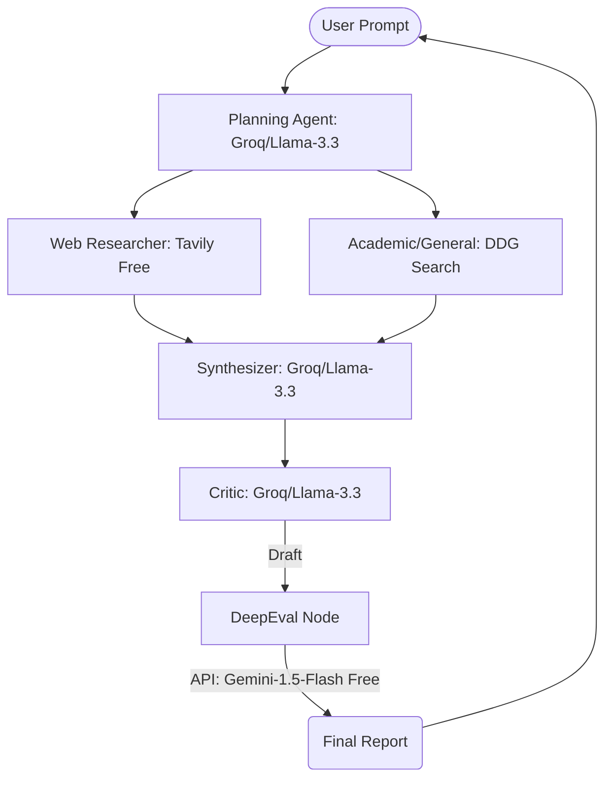

# RFC: Cloud-Free Cutting-Edge Research System (The "Cloud Hive")

## 1. Context & Objective
Build an enterprise-grade research engine using **online free-tier APIs**. This architecture prioritizes speed (Groq) and standardized search (Tavily) while remaining 100% cost-free.

---

## 2. Cloud-Free Optimization Strategy
- **Primary LLM Engine (Groq)**: Use `Llama-3.3-70b-versatile` via Groq's Free Tier. It is significantly faster than local models and has 128k context.
- **Search Strategy**: 
    - **Primary**: `Tavily API` (Free Tier: 1,000 searches/month - specialized for AI).
    - **Fallback/Aggregator**: `DuckDuckGo Search` (Free, no API key required).
- **Evaluation**: 
    - Use `Gemini 1.5 Flash` (Free Tier via Google AI Studio) or `Groq` as the **DeepEval Judge**. This provides a second opinion from a different model family.
- **Orchestration**: `LangGraph` for state management, ensuring we can handle rate limits gracefully.

---

## 3. Revised Data Flow

---

## 4. Engineering Challenges (Free Tier)
- **Rate Limiting**: Groq and Gemini have strict Requests-Per-Minute (RPM) limits. We must implement **RateLimit Decorators** and **Graceful Retries**.
- **Context Pruning**: Fast search results can blow past token limits. We will implement high-density cleaning (stripping HTML, boilerplate) before feeding context to the LLM.
- **Model Diversity**: Using Llama-3 (Groq) for generation and Gemini for evaluation reduces "bias loops" where a model agrees with its own mistakes.

---

## 5. Implementation Roadmap
1.  **Environment**: Set up keys for Groq, Tavily, and Google AI Studio.
2.  **MCP Hub**: Build a cloud-ready tool server.
3.  **Graph Skeleton**: Implement the LangGraph flow with Rate-Limit protections.
4.  **Eval Logic**: Connect Gemini as the quality judge.

---

## 6. User Review Required

> [!IMPORTANT]
> Since we are using cloud APIs, you will need to sign up for:
> 1. [Groq Cloud](https://console.groq.com/) (Free)
> 2. [Tavily](https://tavily.com/) (Free)
> 3. [Google AI Studio](https://aistudio.google.com/) (Free - optional but recommended for Evals).
